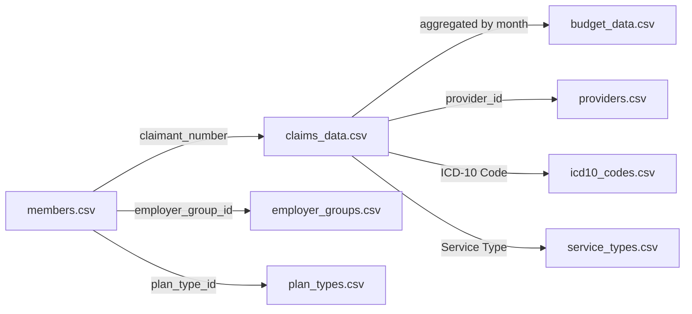

# Healthcare Analytics Sample Data Documentation

## Overview
This directory contains comprehensive sample data for the Healthcare Analytics Dashboard. The data simulates a realistic healthcare insurance company's operational data including member enrollment, medical claims, budget tracking, and various reference data tables.

## Data Statistics
- **Members**: 1,200 enrolled members
- **Claims**: 5,000 medical and pharmacy claims  
- **Time Period**: 24 months of historical data
- **Providers**: 250 healthcare providers
- **Employers**: 25 employer groups

## Directory Structure
```
sample_data/
├── main_data/          # Core operational data
│   ├── budget_data.csv
│   ├── claims_data.csv
│   └── members.csv
└── reference_data/     # Lookup/reference tables
    ├── employer_groups.csv
    ├── geographic_regions.csv
    ├── icd10_codes.csv
    ├── plan_types.csv
    ├── providers.csv
    └── service_types.csv
```

## Main Data Files

### 1. budget_data.csv (24 rows)
Monthly aggregated financial data for budget tracking and variance analysis.

**Key Columns:**
- `month` - Month identifier (e.g., "Jan 2024")
- `budget` - Monthly budget allocation
- `medical_claims` - Total medical claim costs
- `rx_claims` - Total pharmacy claim costs
- `inpatient` - Inpatient service costs
- `outpatient` - Outpatient service costs
- `professional` - Professional service costs
- `emergency` - Emergency service costs
- `admin_fees` - Administrative fees
- `stop_loss_premium` - Stop loss insurance premiums
- `stop_loss_reimb` - Stop loss reimbursements
- `rx_rebates` - Pharmacy rebates received
- `wellness_programs` - Wellness program costs
- `domestic_claims` - Claims within domestic region
- `non_domestic_claims` - International claims
- `employee_count` - Active employees
- `dependent_count` - Active dependents
- `retiree_count` - Active retirees
- `total_enrollment` - Total covered lives
- `loss_ratio` - Claims to premium ratio (%)
- `net_cost` - Net cost after credits
- `variance` - Budget variance
- `variance_percent` - Variance percentage

### 2. claims_data.csv (5,000 rows)
Individual medical and pharmacy claims with diagnosis codes and costs.

**Key Columns (Required by Application):**
- `Claimant Number` - Member's claimant ID
- `Service Type` - Type of medical service
- `Medical` - Medical portion of claim cost
- `Rx` - Pharmacy portion of claim cost
- `Total` - Total claim amount
- `ICD-10-CM Code` - Diagnosis code
- `Medical Description` - Clinical description
- `Layman's Term` - Patient-friendly description

**Additional Columns:**
- `claim_id` - Unique claim identifier
- `member_id` - Internal member ID
- `service_date` - Date of service
- `provider_id` - Provider reference
- `domestic_flag` - Domestic vs international
- `plan_type_id` - Insurance plan reference
- `diagnosis_category` - Chronic/Acute classification
- `hcc_code` - Hierarchical Condition Category
- `risk_score` - Member risk score
- `paid_date` - Payment date
- `status` - Claim status (Paid/Pending/Denied)

### 3. members.csv (1,200 rows)
Member enrollment and demographic information.

**Key Columns:**
- `member_id` - Unique member identifier
- `claimant_number` - Claimant ID (links to claims)
- `first_name` - Member first name
- `last_name` - Member last name
- `dob` - Date of birth
- `age` - Current age
- `gender` - Gender (M/F)
- `email` - Email address
- `phone` - Phone number
- `address` - Street address
- `city` - City
- `state` - State code
- `zip` - ZIP code
- `employer_group_id` - Employer reference
- `plan_type_id` - Insurance plan reference
- `enrollment_date` - Coverage start date
- `termination_date` - Coverage end date (if terminated)
- `member_type` - Employee/Dependent/Retiree
- `dependent_count` - Number of dependents
- `risk_score` - Health risk score
- `chronic_conditions` - Count of chronic conditions
- `status` - Active/Terminated

## Reference Data Files

### 1. service_types.csv (16 rows)
Medical service type definitions and typical costs.

**Columns:**
- `service_type_id` - Unique identifier
- `service_type` - Service name
- `category` - Medical/Ancillary
- `requires_auth` - Prior authorization required
- `typical_cost_min` - Minimum typical cost
- `typical_cost_max` - Maximum typical cost

### 2. icd10_codes.csv (20 rows)
Common diagnosis codes with descriptions.

**Columns:**
- `icd10_code` - ICD-10-CM code
- `medical_description` - Clinical description
- `laymans_term` - Patient-friendly term
- `diagnosis_category` - Chronic/Acute
- `hcc_code` - HCC mapping
- `risk_weight` - Risk adjustment weight

### 3. plan_types.csv (10 rows)
Insurance plan configurations.

**Columns:**
- `plan_type_id` - Unique identifier
- `plan_name` - Plan name
- `plan_code` - Plan code
- `deductible` - Annual deductible
- `oop_max` - Out-of-pocket maximum
- `coinsurance` - Coinsurance rate
- `premium_employee` - Employee premium
- `premium_employer` - Employer contribution

### 4. providers.csv (250 rows)
Healthcare provider directory.

**Columns:**
- `provider_id` - Unique identifier
- `provider_name` - Provider/facility name
- `provider_type` - Type of provider
- `specialty` - Medical specialty
- `address` - Street address
- `city`, `state`, `zip` - Location
- `phone` - Contact number
- `in_network` - Network status
- `quality_rating` - Quality score (1-5)
- `avg_cost_index` - Cost index

### 5. geographic_regions.csv (50 rows)
Geographic region definitions.

**Columns:**
- `region_id` - Unique identifier
- `region_name` - Region name
- `country` - Country
- `domestic_flag` - Domestic indicator
- `cost_index` - Regional cost index

### 6. employer_groups.csv (25 rows)
Employer group information.

**Columns:**
- `employer_group_id` - Unique identifier
- `company_name` - Company name
- `industry` - Industry sector
- `size` - Company size category
- `effective_date` - Contract start date
- `status` - Active/Terminated

## How to Use This Data

### Loading into the Dashboard

1. **Start the application** (if not already running):
   ```bash
   npm run dev
   ```

2. **Navigate to the dashboard** at http://localhost:3005

3. **Upload the CSV files**:
   - First box: Upload `sample_data/main_data/budget_data.csv`
   - Second box: Upload `sample_data/main_data/claims_data.csv`

4. **Dashboard will automatically**:
   - Validate the data format
   - Process and aggregate the data
   - Display all charts and tables
   - Calculate metrics and KPIs

### Data Relationships



### Key Metrics in the Data

- **Loss Ratio**: Average 122.3% (claims exceed premiums)
- **Active Enrollment**: 975 members (81% retention)
- **Chronic Conditions**: 44% of members have 1+ chronic conditions
- **Average Claim**: $10,016
- **Domestic vs International**: 85% domestic claims

### Data Quality Notes

1. **Realistic Distributions**:
   - Age distribution follows typical employer group (mean 45 years)
   - Claim costs follow healthcare industry patterns
   - 5% of claims are high-cost outliers (realistic for healthcare)

2. **Referential Integrity**:
   - All member IDs in claims exist in members table
   - All provider IDs are valid references
   - Date ranges are consistent

3. **Business Logic**:
   - Terminated members have no claims after termination date
   - Risk scores correlate with chronic conditions
   - Budget variance realistic for healthcare (±8%)

## Customization

To generate new sample data with different parameters:

1. Edit `generate_sample_data.py`
2. Modify configuration variables:
   - `NUM_MEMBERS` - Number of members
   - `NUM_CLAIMS` - Number of claims
   - `MONTHS_OF_DATA` - Historical months
3. Run: `python3 generate_sample_data.py`

## Support

For questions about the data structure or the dashboard application, please refer to the main project README or contact the development team.

---
Generated with Healthcare Analytics Sample Data Generator v1.0
